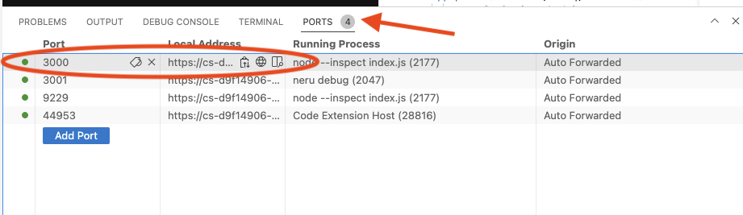

# Voice Call Screening

This project shows how to setup Voice Call Screening.

To start debugging the project, open the "Run and Debug" menu on the left side. Then start the debugger by clicking the play button.


In the bottom panel open the "Ports" then choose the link for port 3000 to open the project in your browser.



If you would like to deploy your project, in the bottom panel open the "Terminal" and run the deploy command

```
neru deploy
```

Once deployed, you will get two new urls for the deployed version of your project. The second url, ending in `.com`, is better suited for use with static webpages.